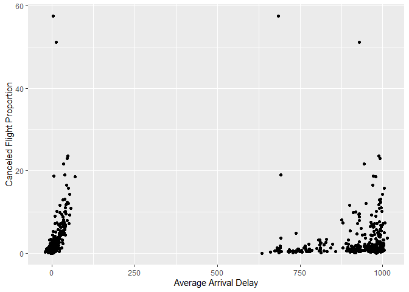

Stat433\_hw1\_md
================
Haoxuan Sun
9/25/2022

``` r
library(nycflights13)
```

    ## Warning: package 'nycflights13' was built under R version 4.1.3

``` r
library(tidyverse)
```

    ## Warning: package 'tidyverse' was built under R version 4.1.2

    ## -- Attaching packages --------------------------------------- tidyverse 1.3.1 --

    ## v ggplot2 3.3.5     v purrr   0.3.4
    ## v tibble  3.1.6     v dplyr   1.0.8
    ## v tidyr   1.2.0     v stringr 1.4.0
    ## v readr   2.1.2     v forcats 0.5.1

    ## Warning: package 'tibble' was built under R version 4.1.3

    ## Warning: package 'tidyr' was built under R version 4.1.3

    ## Warning: package 'readr' was built under R version 4.1.2

    ## Warning: package 'purrr' was built under R version 4.1.3

    ## Warning: package 'dplyr' was built under R version 4.1.3

    ## -- Conflicts ------------------------------------------ tidyverse_conflicts() --
    ## x dplyr::filter() masks stats::filter()
    ## x dplyr::lag()    masks stats::lag()

``` r
flight = flights
```

``` r
#1.
flight_missing_dep = flights %>% filter(is.na(dep_time)) %>% 
  summarise(n = nrow(.))
flight_missing_dep
```

    ## # A tibble: 1 x 1
    ##       n
    ##   <int>
    ## 1  8255

``` r
flight_missing_dep_map = flights %>% filter(is.na(dep_time))
flight_missing_dep_map
```

    ## # A tibble: 8,255 x 19
    ##     year month   day dep_time sched_dep_time dep_delay arr_time sched_arr_time
    ##    <int> <int> <int>    <int>          <int>     <dbl>    <int>          <int>
    ##  1  2013     1     1       NA           1630        NA       NA           1815
    ##  2  2013     1     1       NA           1935        NA       NA           2240
    ##  3  2013     1     1       NA           1500        NA       NA           1825
    ##  4  2013     1     1       NA            600        NA       NA            901
    ##  5  2013     1     2       NA           1540        NA       NA           1747
    ##  6  2013     1     2       NA           1620        NA       NA           1746
    ##  7  2013     1     2       NA           1355        NA       NA           1459
    ##  8  2013     1     2       NA           1420        NA       NA           1644
    ##  9  2013     1     2       NA           1321        NA       NA           1536
    ## 10  2013     1     2       NA           1545        NA       NA           1910
    ## # ... with 8,245 more rows, and 11 more variables: arr_delay <dbl>,
    ## #   carrier <chr>, flight <int>, tailnum <chr>, origin <chr>, dest <chr>,
    ## #   air_time <dbl>, distance <dbl>, hour <dbl>, minute <dbl>, time_hour <dttm>

``` r
# the dep_delay, arr_time, arr_delay are all missing, 
# indicating the flight might be canceled
```

``` r
#2.
flight_time_mutated = flight %>% 
  mutate(dep_time = dep_time %% 100 + dep_time %/% 100 * 60,
         sched_dep_time = sched_dep_time %% 100 + sched_dep_time %/% 100 * 60)

flight_time_mutated
```

    ## # A tibble: 336,776 x 19
    ##     year month   day dep_time sched_dep_time dep_delay arr_time sched_arr_time
    ##    <int> <int> <int>    <dbl>          <dbl>     <dbl>    <int>          <int>
    ##  1  2013     1     1      317            315         2      830            819
    ##  2  2013     1     1      333            329         4      850            830
    ##  3  2013     1     1      342            340         2      923            850
    ##  4  2013     1     1      344            345        -1     1004           1022
    ##  5  2013     1     1      354            360        -6      812            837
    ##  6  2013     1     1      354            358        -4      740            728
    ##  7  2013     1     1      355            360        -5      913            854
    ##  8  2013     1     1      357            360        -3      709            723
    ##  9  2013     1     1      357            360        -3      838            846
    ## 10  2013     1     1      358            360        -2      753            745
    ## # ... with 336,766 more rows, and 11 more variables: arr_delay <dbl>,
    ## #   carrier <chr>, flight <int>, tailnum <chr>, origin <chr>, dest <chr>,
    ## #   air_time <dbl>, distance <dbl>, hour <dbl>, minute <dbl>, time_hour <dttm>

``` r
#3.
flight_calcelled = flight %>%
  group_by(year, month, day) %>%
  summarise(canceled = sum(is.na(arr_delay)),
            total_flights = n(),
            avg_delay = sum(na.omit(arr_delay)) / total_flights,
            canceled_prop = (canceled / total_flights) * 100
            ) %>% 
    ggplot() + 
    geom_point(aes(x = avg_delay, 
    y = canceled_prop)
    ) + 
    labs(x = "Average Arrival Delay", 
        y = "Canceled Flight Proportion") +
    geom_point(aes(x = total_flights,
                    y = canceled_prop))
```

    ## `summarise()` has grouped output by 'year', 'month'. You can override using the
    ## `.groups` argument.

``` r
flight_calcelled
```

<!-- -->

``` r
# As average arrival delay increases,
# the canceled flight proportion also increase.
# Days with larger tital flights tend to have
# larger cancel proportion.
```
